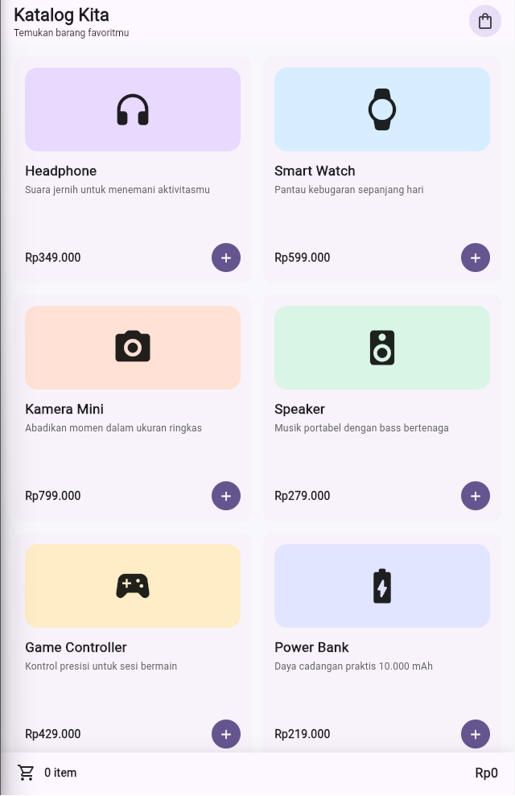
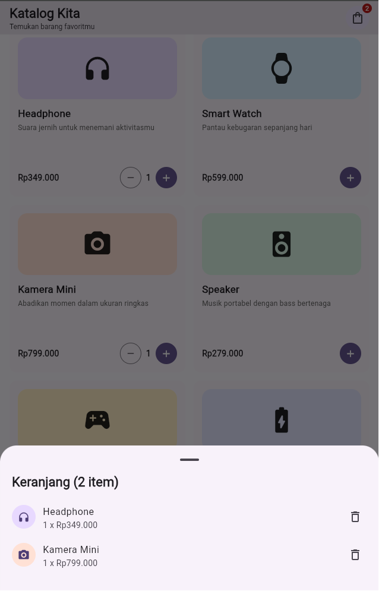

# Katalog Kita - Flutter Cubit

Katalog Kita adalah aplikasi katalog produk dan keranjang belanja sederhana yang dibuat untuk Praktikum ABP Pertemuan 11. Aplikasi ini menerapkan state management **Cubit** dari package `flutter_bloc`.

## Fitur

- Menampilkan enam produk dalam bentuk grid.
- Menambahkan dan mengurangi jumlah produk di keranjang.
- Menampilkan jumlah item melalui badge keranjang.
- Menghitung total harga secara otomatis.
- Menampilkan isi keranjang melalui bottom sheet.
- Memperbarui antarmuka secara real-time menggunakan `BlocBuilder`.

## Output Aplikasi

### Daftar produk



### Keranjang belanja



## Laporan Praktikum

Dokumentasi lengkap praktikum dapat dibaca pada file berikut:

[Laporan Praktikum.pdf](Laporan%20Praktikum.pdf)

Versi Markdown laporan juga tersedia di [LAPORAN.md](LAPORAN.md).

## Struktur Utama

```text
lib/
|-- cubit/
|   `-- cart_cubit.dart      # State dan logika keranjang
|-- models/
|   `-- product.dart         # Model serta data produk
|-- pages/
|   `-- product_page.dart    # Tampilan katalog dan keranjang
`-- main.dart                # Entry point dan BlocProvider
```

## Menjalankan Aplikasi

Pastikan Flutter SDK sudah terpasang, lalu jalankan:

```bash
flutter pub get
flutter run
```

## Pengujian

```bash
flutter analyze
flutter test
```

## Teknologi

- Flutter
- Dart
- `flutter_bloc`
- Cubit
