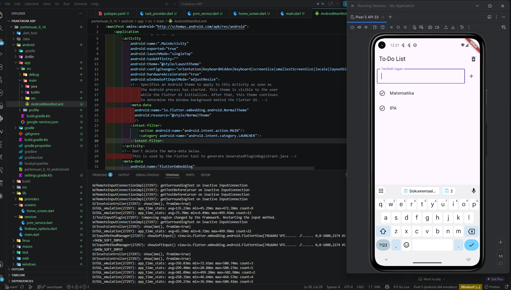
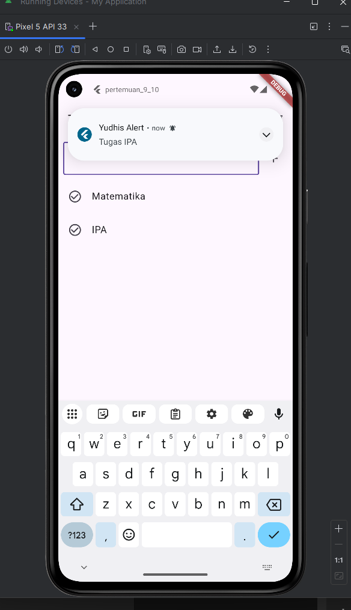

# Laporan Praktikum ABP - Pertemuan 9 dan 10

## Identitas

- Nama: Bintang Yudhistira
- NIM: 2311102052
- Proyek: Aplikasi To-Do List dengan Firebase Cloud Messaging

## Deskripsi Singkat

Aplikasi ini merupakan proyek Flutter sederhana untuk mengelola daftar tugas. Pengguna dapat menambahkan tugas melalui kolom input, melihat daftar tugas yang sudah dibuat, dan menghapus seluruh daftar tugas. Aplikasi juga sudah terhubung dengan Firebase Cloud Messaging (FCM) agar dapat menerima notifikasi dari Firebase.

## Hasil Implementasi

### 1. Tampilan Daftar Tugas dan Proses Penambahan Tugas

Pada halaman utama, aplikasi menampilkan judul **To-Do List**, kolom input **Tambah tugas**, tombol tambah, tombol hapus semua tugas, serta daftar tugas yang sudah dimasukkan. Contoh tugas yang berhasil ditambahkan adalah **Matematika** dan **IPA**.

### 2. Notifikasi Berhasil Diterima Aplikasi

Notifikasi dari Firebase Cloud Messaging berhasil diterima oleh aplikasi. Pesan masuk kemudian ditampilkan sebagai notifikasi lokal pada perangkat Android menggunakan package `flutter_local_notifications`.

## Penjelasan Implementasi

Aplikasi menggunakan package `provider` untuk mengelola state daftar tugas. Data tugas disimpan dalam `TaskProvider`, kemudian ditampilkan pada `HomeScreen` menggunakan `ListView.builder`. Saat tombol tambah ditekan, teks dari input akan dimasukkan ke daftar tugas selama input tidak kosong.

Integrasi notifikasi dilakukan dengan Firebase. Pada saat aplikasi dijalankan, Firebase diinisialisasi melalui `Firebase.initializeApp()`, lalu `FCMService().initFCM()` meminta izin notifikasi, mengambil token FCM, dan mendengarkan pesan masuk melalui `FirebaseMessaging.onMessage`. Jika pesan diterima saat aplikasi aktif, pesan tersebut ditampilkan sebagai notifikasi lokal.

## File Penting

- `lib/main.dart`: Inisialisasi Firebase, FCM, dan provider aplikasi.
- `lib/screens/home_screen.dart`: Tampilan utama daftar tugas dan form tambah tugas.
- `lib/providers/task_provider.dart`: Pengelolaan data tugas.
- `lib/services/pcm_service.dart`: Konfigurasi Firebase Cloud Messaging dan local notification.
- `android/app/src/main/AndroidManifest.xml`: Konfigurasi channel notifikasi Android.

## Output yang Dikumpulkan

- Source code proyek Flutter pada folder `pertemuan_9_10`.
- Laporan singkat ini berisi screenshot dan penjelasan hasil implementasi.
